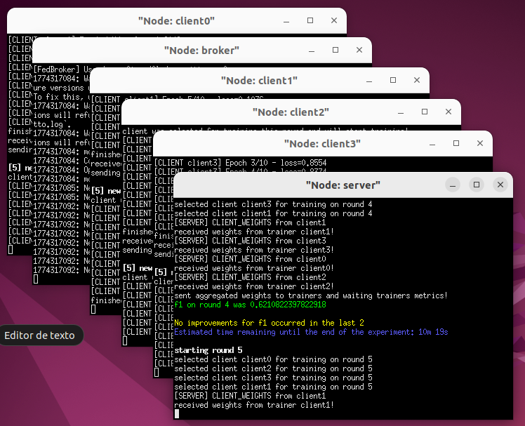
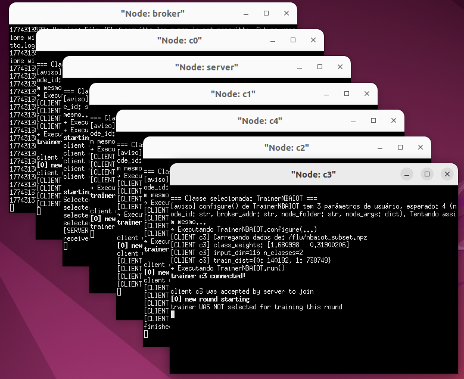

# MininetFed 2.0 - SBRC 2026

Este repositório contém instruções para instalação e execução dos
artefatos MininetFed 2.0 e casos de uso para o artigo\
**"MininetFed 2.0: Uma Ferramenta Programável para Emulação e Análise de
Aprendizado Federado em Redes"**.

Para conveniência dos revisores, uma máquina virtual com o sistema
operacional Ubuntu 22.04 pode ser baixada em:

[Download da VM](https://drive.google.com/file/d/1gQtTdE7hsGXX_15tADN4FrVSuMcuLFBa/view?usp=sharing)

Essa VM já está configurada com a instalação do MininetFed 2.0 e todas
as suas dependências. Caso esteja utilizando a VM, pule diretamente para
a seção [Casos de Uso](#casos-de-uso).

Um video com a demonstração de um dos casos de uso abaixo se encontra em:

https://www.youtube.com/watch?v=jPpaY-sV7TQ

------------------------------------------------------------------------

# Instalação do MininetFed 2.0 e Dependências

Para a instalação do MininetFed 2.0, é necessário sistema operacional Linux Ubuntu com versão no máximo 24.04.

## Dependências

Garantir que o pip está atualizado:

```
sudo python3 -m pip install --upgrade pip
```

Instalação dos pacotes de dependência:

```
sudo apt install ansible git aptitude unrar python3-numpy python3-pandas
python3-sklearn python3-paho-mqtt python3-docker
```

Instalação do Containernet:

```
git clone https://github.com/ramonfontes/containernet.git
cd containernet/
sudo util/install.sh -W
```

## MininetFed 2.0

```
cd ~
git clone https://github.com/lprm-ufes/MininetFed-2.0-SBRC-2026.git
cd MininetFed-2.0-SBRC-2026/
sudo python setup.py install
```

------------------------------------------------------------------------

# Casos de Uso

## Execução do caso de uso 1: Dataset EHMS

O dataset EHMS (Edge Health Monitoring System) é um conjunto de dados
voltado ao monitoramento de saúde em ambientes IoT, combinando
informações biomédicas e métricas de rede para detecção de anomalias e
classificação.

Mais informações sobre o dataset podem ser obtidas em: https://www.cse.wustl.edu/\~jain/ehms/index.html

Neste caso de uso, são criados 4 clientes com divisão do dataset seguindo distribuição iid ou non-iid (α
= 0.8). Utiliza-se FedAvg para agregação dos pesos do modelo e políticas padrão de aceitação e seleção de clientes, com 
participação de todos os clientes em cada rodada.

```
cd ~/MininetFed-2.0-SBRC-2026/MininetFed-EHMS-Example/
sudo python ehms_fed.py
```
Durante a execução serão abertos 6 terminais (1 broker, 1 servidor e 4 
clientes).



Os resultados do experimentos federado serão salvos na pasta server_output:

-   **metrics_summary.txt**: métricas finais\
-   **learning_curve.csv**: evolução por rodada\
-   **best.model.npz**: melhor modelo

------------------------------------------------------------------------

## Execução do caso de uso 2: Dataset N-BaIoT

O dataset N-BaIoT é utilizado para detecção de ataques em dispositivos
IoT infectados por botnets (Mirai e Gafgyt), contendo milhões de
amostras distribuídas por 9 dispositivos. Mais informações em:
https://archive.ics.uci.edu/dataset/442/detection+of+iot+botnet+attacks+n+baiot

Para esse dataset não foi utilizado o módulo de geração de clientes e divisão de 
datasets do MininetFed 2.0 uma vez que o dataset já é naturalmente separado em 9 
dispositivos, mas foi necessária a criação de um script para montagem dos clientes. Por 
questões de desempenho, somente 5 dos 9 clientes são usados na VM. 

A política de aceitação de clientes é a padrão (aceitação de todos os clientes) e é usado o 
algoritmo FedAVG para agregação de pesos do modelo. Entretanto, foi  um servidor 
personalizado com política de seleção em fila circular, onde apenas 3 clientes treinam 
por rodada de forma intercalada. Este caso de uso ilustra como o MininetFed 2.0 pode ser 
usado para criar/testar novas políticas de seleção ou algoritmos de agregação de modelos.

Antes de iniciar a execução, é presciso baixar e extrair o dataset NbaIOT dentro da pasta dataset. O 
dataset pode ser obtido em: https://archive.ics.uci.edu/dataset/442/detection+of+iot+botnet+attacks+n+baiot

```
cd ~/MininetFed-2.0-SBRC-2026/MininetFed-nbaiot-Example/
```

Geração dos clientes (executar somente uma vez):
```
python nbaiot_gen_clients.py --data_root ./dataset --out_dir ./clients
--py_src_dir ./client_code -N 5 --mode binary --extract_rar
```

Execução:

```
sudo python nbaiot_fed.py
```

Durante a execução serão abertos 7 terminais.



Resultados em server_output:

-   **metrics_summary.txt**: métricas finais\
-   **learning_curve.csv**: evolução por rodada\
-   **best.model.npz**: melhor modelo